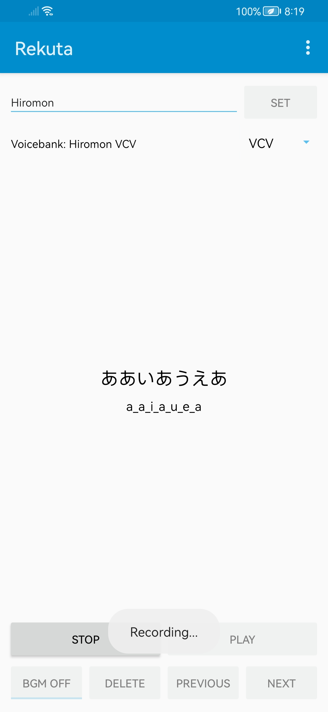
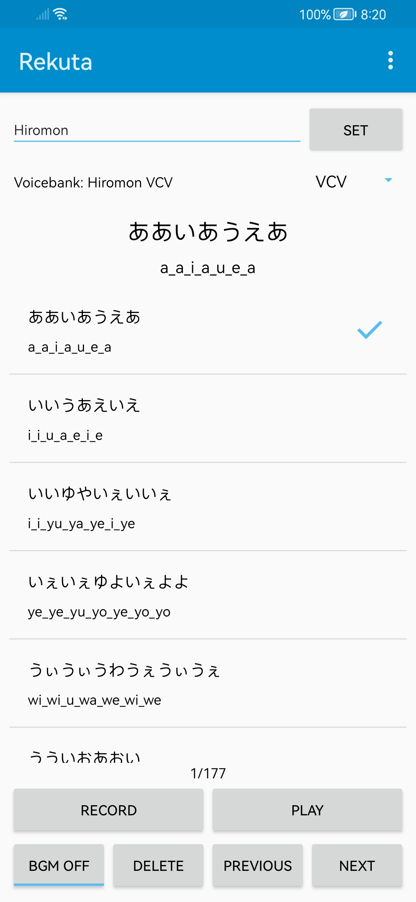
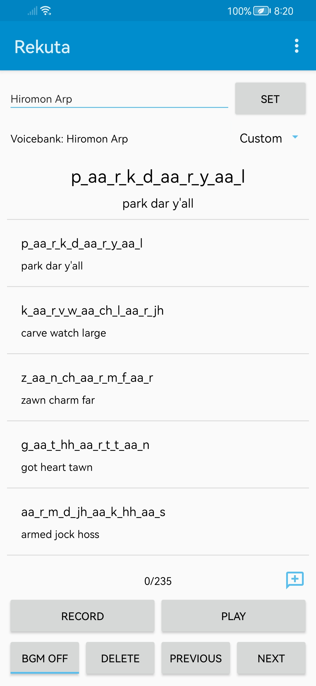

# Rekuta

A simple UTAU voicebank recorder app for android. "Rekuta" stands for **Rec**ord **UTA**U.

## Main Features

- Lossless audio recording
- CV, VCV & Custom reclist support
- Simple UI

## Previews

  
  
  

## License

Rekuta is licensed under GPLv3