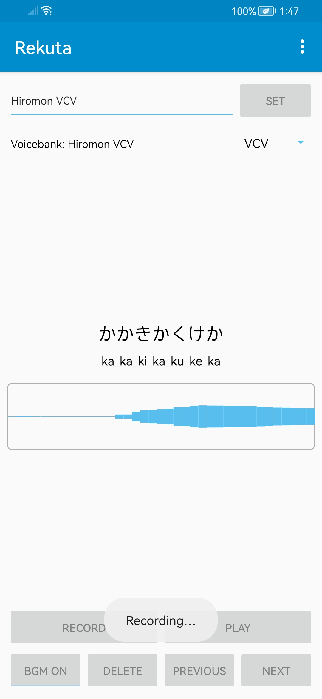
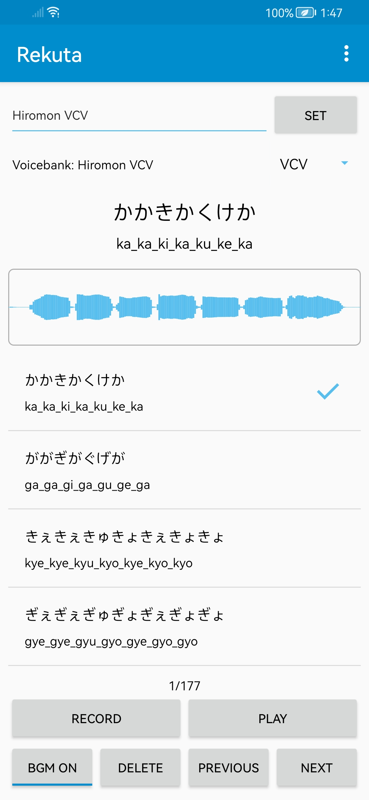
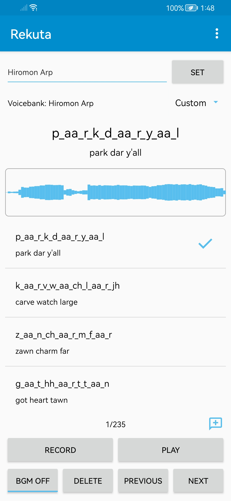

# Rekuta

A simple UTAU voicebank recorder app for android. "Rekuta" stands for **Rec**ord **UTA**U.

## Main Features

- Lossless audio recording
- CV, VCV & Custom reclist support
- Simple UI

## Previews

  <picture>
    <source media="(prefers-color-scheme: dark)" srcset="./misc/preview-dark-1.jpg">
    
  </picture>
  <picture>
    <source media="(prefers-color-scheme: dark)" srcset="./misc/preview-dark-2.jpg">
    
  </picture>
  <picture>
    <source media="(prefers-color-scheme: dark)" srcset="./misc/preview-dark-3.jpg">
    
  </picture>

## License

Rekuta is licensed under GPLv3
